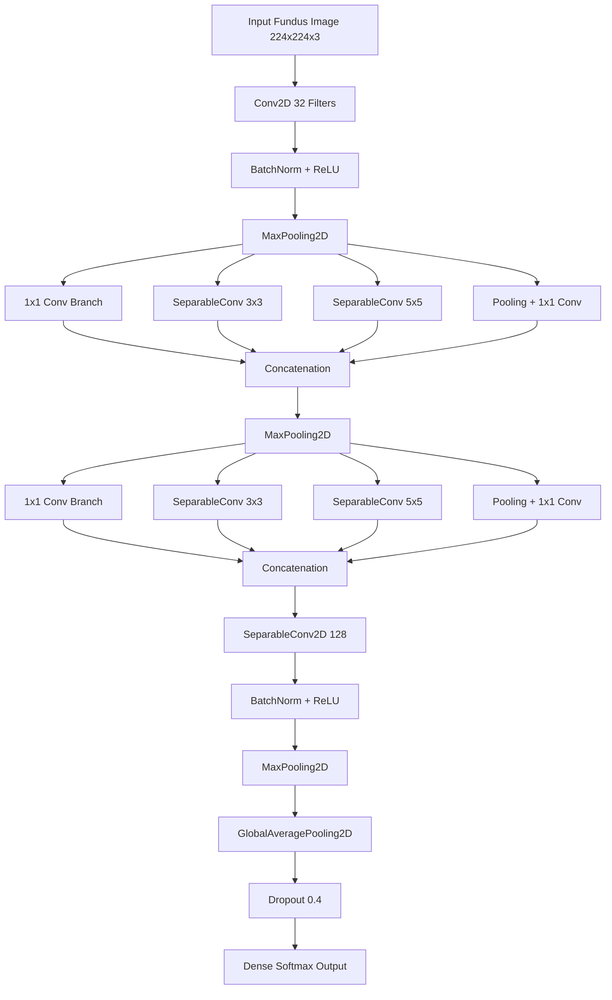

<div align="center">

# 🩺 AI-Powered Retinal Fundus Multi-Disease Screening System
### Ultra-Lightweight TinyML Pipeline for Clinical Edge Diagnostics

[](https://www.python.org/)
[](https://www.tensorflow.org/)
[](https://keras.io/)
[](https://opencv.org/)
[](https://gradio.app/)
[](https://www.tensorflow.org/lite)
[](https://huggingface.co/)
[](https://opensource.org/licenses/MIT)

</div>

---

# 🚀 Live Demo

> ## 🌐 Hugging Face Deployment
> https://huggingface.co/spaces/paulaman1/Fundus-EdgeNet-Pro

---

# 📌 Project Overview

This project presents an end-to-end lightweight AI-powered retinal disease screening pipeline optimized specifically for TinyML and edge-device medical deployment.

The system was designed for:

- ✅ Multi-class retinal disease classification
- ✅ Edge-device compatibility
- ✅ Ultra-lightweight inference
- ✅ TinyML deployment
- ✅ Real-time web prediction
- ✅ Quantized medical AI inference
- ✅ Low computational overhead

Unlike traditional large-scale transfer learning systems that require high-end GPUs and massive storage capacity, this project focuses on designing a highly compact and clinically efficient deep learning pipeline capable of deployment on low-resource hardware systems.

The final production pipeline integrates:

- Knowledge Distillation
- Custom TinyML CNN Architecture
- TensorFlow Lite INT8 Quantization
- Gradio Web Deployment
- Hugging Face Spaces

---

# 🧬 Dataset Information

## 📂 Dataset Used

### 1000 Fundus Images with 39 Categories Dataset

Dataset Source:
Joint Shantou International Eye Centre (JSIEC), Guangdong Province, China

The original dataset consists of retinal fundus photographs collected from:

- Joint Shantou International Eye Centre (JSIEC)
- Shantou City
- Guangdong Province
- China

The dataset represents a small subset of a much larger retinal database containing over:

```text
209,494 Fundus Images
```

Original paper:

```text
Automatic detection of 39 fundus diseases and conditions in retinal photographs using deep neural networks
```

Paper Link:
https://www.nature.com/articles/s41467-021-25138-w

---

# 🎯 Clinical Target Classification

The original 39-category dataset was restructured into 5 clinically important disease categories:

| Disease Category | Label |
|---|---|
| Diabetic Retinopathy | dr |
| Glaucoma | glaucoma |
| Maculopathy | maculopathy |
| Optic Atrophy | optic_atrophy |
| Normal Fundus | normal |

---

# 🔍 Exploratory Data Analysis (EDA)

Before training the deep learning models, detailed EDA was performed.

## Analysis Performed

- Dataset structure analysis
- Class imbalance inspection
- Image distribution verification
- Disease category frequency analysis
- Resolution inspection
- Sample visualization
- Train/Validation/Test split verification

---

# ⚠️ Dataset Imbalance Problem

The raw dataset suffered from severe class imbalance.

Example:

| Disease Category | Original Sample Count |
|---|---|
| Glaucoma | ~13 |
| Optic Atrophy | ~12 |
| Diabetic Retinopathy | 100+ |

This imbalance created major risks of:
- Overfitting
- Biased prediction behavior
- Poor minority class generalization

---

# 🔄 Offline Data Balancing & Augmentation

To solve this issue, a strict offline augmentation pipeline was engineered.

The dataset was balanced using advanced augmentation strategies including:

| Augmentation Technique | Purpose |
|---|---|
| Rotation | Orientation robustness |
| Horizontal Flip | Symmetry learning |
| Vertical Flip | Spatial invariance |
| Brightness Adjustment | Illumination robustness |
| Contrast Enhancement | Feature amplification |
| Zoom Transformations | Scale robustness |
| Translation | Positional robustness |
| Shearing | Geometric variability |
| Blur Operations | Noise tolerance |
| Color Variations | Generalization improvement |

---

# 📊 Final Balanced Dataset Pipeline

| Disease | Balanced Baseline |
|---|---|
| Diabetic Retinopathy | 100 |
| Glaucoma | 100 |
| Optic Atrophy | 97 |
| Maculopathy | 100 |
| Normal | 100 |

The final augmented training data was expanded significantly to improve generalization capability.

---

# 🧠 Transfer Learning Baseline Experiments

Initially, multiple large transfer learning architectures were trained and evaluated:

- VGG16
- VGG19
- ResNet50
- ResNet101
- AlexNet

These models achieved strong classification performance but introduced major deployment problems:

- Extremely large model sizes
- Heavy GPU requirements
- Slow inference
- Poor edge-device compatibility
- Unsuitable for TinyML deployment

---

# ⚠️ Deployment Bottleneck

Although the transfer learning models performed well clinically, they were impractical for:

- Smartphone deployment
- Embedded systems
- Edge AI hardware
- TinyML inference
- Low-memory devices

Example:

| Model | Approximate Size |
|---|---|
| VGG19 | ~131 MB |
| ResNet101 | 170+ MB |
| TinyML Target | <1 MB |

This motivated the development of a custom lightweight architecture.

---

# 💡 TinyML Pivot & Knowledge Distillation

A lightweight CNN was initially developed from scratch.

However:

- Learning convergence was extremely slow
- Feature extraction quality was weak
- Optimization instability occurred

To solve this problem, a Knowledge Distillation (KD) pipeline was introduced.

---

# 👨‍🏫 Teacher-Student Framework

## Teacher Model
```text
VGG19
```

## Student Model
```text
Custom Inception EdgeNet Pro
```

The teacher transferred soft probabilistic feature representations into the lightweight student model.

This allowed the compact model to inherit richer clinical feature representations while remaining computationally lightweight.

---

# ⚡ Numpy Memory Cache Optimization

Another major training bottleneck originated from repeated disk I/O operations during training.

To solve this:

- Images were preloaded into NumPy array memory caches
- CPU-GPU transfer bottlenecks were reduced
- Data feeding throughput improved significantly
- Student model convergence stabilized

This optimization dramatically improved:
- Training speed
- Learning stability
- Mini-batch throughput
- KD convergence efficiency

---

# 🧠 Proposed Inception EdgeNet Pro Architecture

Instead of relying on massive architectures, a highly optimized TinyML-oriented CNN was engineered specifically for retinal pathology extraction.

---

# 🏗️ Architecture Goals

The architecture was designed for:

- Ultra-low parameter count
- Faster inference
- TinyML compatibility
- Edge-device deployment
- Retinal texture extraction
- Efficient multi-scale feature learning
- Reduced memory overhead

---

# ⚡ Lightweight Structural Comparison

| Model | Parameters | File Size |
|---|---|---|
| VGG19 Teacher | ~32.8 Million | ~131 MB |
| Inception EdgeNet Pro | 81,061 | ~0.44 MB |
| Quantized INT8 TFLite | 81,061 | 118.63 KB |

---

# 🏗️ Network Architecture Flow



---

# 🧩 Key Deep Learning Components

# ✅ SeparableConv2D

Depthwise separable convolutions were heavily utilized to:

- Reduce FLOPs
- Reduce parameter count
- Improve TinyML efficiency
- Preserve retinal micro-feature extraction
- Maintain vessel texture representation

---

# ✅ Inception Multi-Branch Blocks

Custom Inception-style branches enabled:

- Multi-scale feature extraction
- Parallel receptive field learning
- Efficient contextual representation

---

# ✅ BatchNormalization

Used throughout the network to:

- Stabilize training
- Improve convergence
- Reduce covariate shift
- Improve KD optimization stability

---

# ✅ GlobalAveragePooling2D

Used instead of dense hidden layers to:

- Reduce overfitting
- Minimize parameter explosion
- Improve generalization
- Preserve spatial consistency

---

# ⚙️ Knowledge Distillation Objective Function

The student model was optimized using a dual-objective KD loss.

```math
L_{total} =
(1 - \alpha) \cdot T^2 \cdot D_{KL}
\left(
\sigma\left(\frac{z_T}{T}\right)
\middle\|
\sigma\left(\frac{z_S}{T}\right)
\right)
+
\alpha \cdot L_{CE}(y,\sigma(z_S))
```

---

# ⚙️ Training Configuration

| Parameter | Value |
|---|---|
| Image Size | 224×224 |
| Batch Size | 32 |
| Student Epochs | 150 |
| Teacher Epochs | 8 |
| Optimizer | Adam |
| Learning Rate | 0.001 |
| KD Temperature | 3.0 |
| Alpha | 0.4 |

---

# 📉 Optimization Callbacks

## ReduceLROnPlateau

Used for:
- Dynamic learning rate reduction
- Plateau recovery
- Stable convergence

---

## EarlyStopping

Used for:
- Preventing overfitting
- Preserving best weights
- Improving generalization

---

# ⚡ TensorFlow Lite Quantization

The trained `.keras` model was converted into:

```text
INT8 TensorFlow Lite Model
```

using:

- Concrete Function Graph Tracing
- Post-training integer quantization

---

# 📦 Final TinyML Model Size

```text
118.63 KB
```

This enables deployment on:
- Embedded systems
- Low-memory devices
- Edge AI hardware
- Microcontrollers

---

# 📊 Final Benchmark Performance

| Model | Accuracy | File Size |
|---|---|---|
| VGG19 Teacher | 94.12% | ~131 MB |
| Inception EdgeNet Pro | 96.08% | 0.44 MB |
| INT8 TFLite Model | 96.08% | 118.63 KB |

---

# 📋 Final Classification Report

| Class | Precision | Recall | F1-Score |
|---|---|---|---|
| dr | 1.00 | 1.00 | 1.00 |
| glaucoma | 1.00 | 0.67 | 0.80 |
| maculopathy | 0.88 | 1.00 | 0.94 |
| normal | 1.00 | 1.00 | 1.00 |
| optic_atrophy | 1.00 | 0.67 | 0.80 |

---

# 🌐 Hugging Face Deployment

The final production pipeline was deployed publicly using:

- Hugging Face Spaces
- Gradio
- TensorFlow Lite

---

# 🌐 Web Application Features

## Deployment Features

- 📤 Fundus Image Upload
- ⚡ Real-Time Inference
- 🧠 Multi-Class Disease Classification
- 📊 Confidence Probability Visualization
- ⚡ TFLite Inference Engine
- 🛡️ Confidence-Based Rejection Layer
- ☁️ Cloud Deployment

---

# 🛡️ Confidence-Based Safety Layer

Medical AI systems should avoid unsafe forced predictions.

A custom confidence rejection system was implemented.

---

# 🚫 Invalid / Unknown Image Rejection

If prediction confidence falls below:

```text
85%
```

the image is rejected as:

```text
Invalid / Unknown Image
```

This helps reduce unsafe predictions on:
- Poor-quality fundus images
- Out-of-distribution images
- Random objects
- Non-retinal content

---

# 🧠 Inference Pipeline

The deployed application performs:

1. Image Upload
2. Fundus Image Preprocessing
3. Tensor Conversion
4. TFLite Inference
5. Confidence Estimation
6. Disease Classification
7. Safety Threshold Validation

---

# 📦 Technologies Used

| Technology | Purpose |
|---|---|
| Python | Core Programming |
| TensorFlow | Deep Learning |
| Keras | CNN Modeling |
| TensorFlow Lite | TinyML Deployment |
| OpenCV | Image Processing |
| NumPy | Numerical Computing |
| Matplotlib | Visualization |
| Gradio | Web UI |
| Hugging Face Spaces | Cloud Deployment |

---

# 📁 Project Structure

```text
project/
│
├── app.py
├── README.md
├── requirements.txt
├── best_student_model.keras
├── fundus_inception_edgenet_pro_int8.tflite
│
├── training/
│   ├── teacher_training.ipynb
│   ├── student_kd_training.ipynb
│   ├── quantization_pipeline.ipynb
│   └── evaluation.ipynb
│
├── assets/
│   ├── architecture.png
│   ├── confusion_matrix.png
│   ├── predictions.png
│   └── model_comparison.png
```

---

# ⚠️ Disclaimer

This project is intended strictly for:

- AI research
- Educational experimentation
- TinyML validation
- Medical imaging studies

This system is NOT a certified medical diagnostic tool.

All predictions should always be verified by:
- Ophthalmologists
- Medical professionals
- Clinical experts

Uploading:
- Random images
- Non-retinal content
- Poor-quality scans

may produce unreliable predictions.

---

# 🔮 Future Improvements

Potential future upgrades include:

- Grad-CAM explainability
- Mobile deployment
- On-device Android inference
- Real-time camera integration
- Multi-disease expansion
- Clinical calibration analysis
- Federated medical learning
- Edge TPU optimization

---

# 📌 Conclusion

This project demonstrates that highly compact TinyML architectures can achieve strong retinal disease classification performance while remaining lightweight enough for real-world edge deployment.

Final achievements:

- ✅ 96.08% Test Accuracy
- ✅ 118 KB TinyML Model
- ✅ Real-time TFLite inference
- ✅ Public Hugging Face deployment
- ✅ Multi-class retinal disease screening
- ✅ Knowledge Distillation optimization
- ✅ Ultra-lightweight edge deployment

---

# 👨‍💻 Author

## Aman Paul

AI • Deep Learning • TinyML • Medical Imaging • Computer Vision

---
